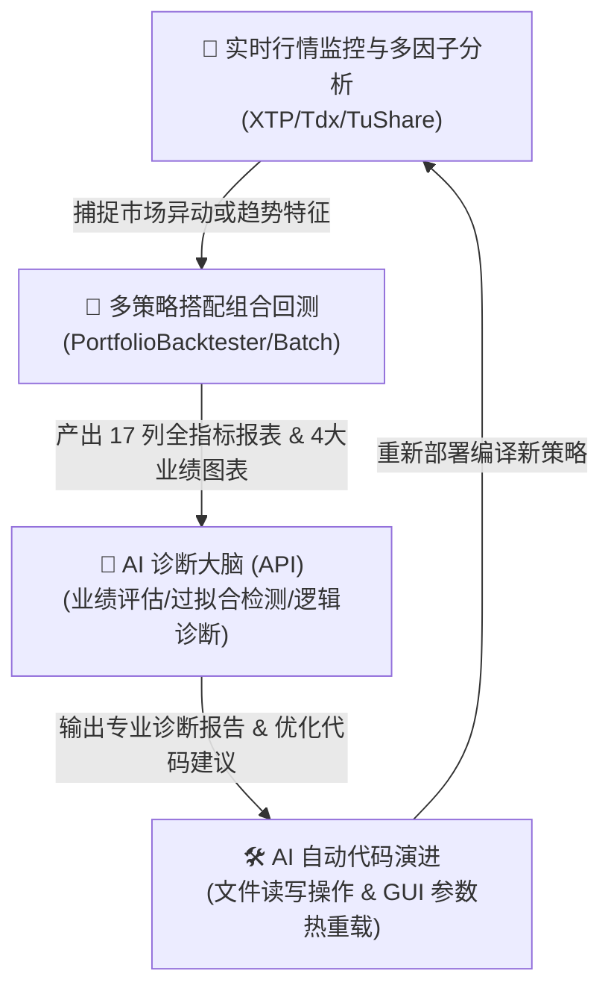

# 🚀 AI智能自演进量化交易终端可行性与架构设计方案报告

本报告旨在对用户提出的“智能监控行情 + 行情分析 + 多策略搭配测试 + AI检测策略效果 + 策略修改”这一自闭环 AI 量化终端构想进行深度可行性评估与架构设计规划。

---

## 🗺️ 总体可行性评估
在前一阶段的工作中，我们已经成功打通了 **VeighNa 官方底层引擎** 与 **批量多线程计算** 的融合，并实现了**原生图表的可视化重用**。
以此为坚实基石，引入 LLM 大语言模型 API 并结合 VN.py 底层丰富的交易接口，实现**“监控-分析-回测-诊断-代码自动修改”**的自闭环系统不仅完全可行，且技术路线非常清晰。

以下是整体架构的闭环流程设计：

---

## 🔍 各核心模块深度技术剖析

### 1. 📡 智能行情监控与行情分析 (Real-time Monitoring & Analysis)
* **功能描述**：对 A 股全市场（或核心自选股池）进行实时 tick 级/分钟级监控，包括量能骤增、主力拉升、突破支撑阻力位等异动，并动态计算多因子技术指标。
* **VN.py 支撑度**：**极高（框架原生支持）**。
  * **行情获取**：VN.py 的 `XtpGateway`（股票）、`TdxGateway`（免费实时行情）或 Websocket 接口可直接获取毫秒级 Tick 数据。
  * **数据存储与分析**：利用 VN.py 的 `DataRecorder`（数据记录器）和内置的 `Utility.ArrayManager`（K线序列管理器），可以在毫秒级内自动计算出 MACD、RSI、布林带、成交量因子等并触发预警。
* **技术难点**：多股实时高频计算的线程负载。
* **解决方案**：引入 `ThreadPoolExecutor` 或使用 Redis 作为数据缓存队列，将行情监控界面与回测/计算主线程解耦，确保 GUI 永不卡顿。
* **难度系数**：★★★☆☆（中等）

---

### 2. 📂 多策略搭配组合测试 (Portfolio Combination Testing)
* **功能描述**：将多种不同逻辑的策略（如：均线趋势策略 + 网格震荡策略 + 多因子选股策略）按不同资金权重分配在多个股票上，跑多资产组合回测（Portfolio Backtesting），分析策略间的相关性，进行风险对冲。
* **VN.py 支撑度**：**极高（官方原生应用）**。
  * **底座支撑**：VeighNa 框架自带 `PortfolioBacktester`（组合回测 App）。它支持多合约、多策略的资产配置组合计算，能算出组合级别的 Sharpe Ratio 和最大回撤。
  * **实现路径**：我们可以将官方的 `PortfolioBacktestingEngine` 直接重用到我们的批量回测终端中，增加一个“组合测试面板”，让用户一键勾选多个股票和多个策略自由搭配，输出整个投资组合的净值曲线。
* **难度系数**：★★★☆☆（中等）

---

### 3. 🧠 AI检测策略效果 (AI-Driven Strategy Diagnosis)
* **功能描述**：AI 扮演首席量化分析师（Chief Quant Analyst），对回测结果进行深度诊断。自动识别当前策略在哪些股票上亏钱（例如“震荡市导致趋势策略频繁打脸”）、是否存在过度拟合、参数敏感度如何。
* **实现路径**：
  * **数据打包**：将回测算出的 20+ 项业绩指标字典（`stats`）、每日盈亏数据序列（DataFrame 摘要）以及当前的策略 Python 源代码打包成结构化上下文。
  * **提示词工程 (Prompt Engineering)**：设计一套极专业的金融分析提示词，调用大模型（Gemini / OpenAI API）。
  * **AI 分析输出**：AI 会返回一份包含“盈利归因”、“风险暴露分析”、“逻辑漏洞警示”和“参数微调方向”的首席分析师诊断书。
* **难度系数**：★★☆☆☆（较低，核心在于 Prompt 的专业度）

---

### 4. 🛠️ AI自主策略修改与演进 (AI-Driven Auto-Code Modification)
* **功能描述**：根据诊断结果，AI 直接修改策略参数，甚至**自动重写策略 Python 源代码中的交易逻辑**（例如修改止盈止损条件，加入多因子防冲高过滤器），并在 GUI 界面中一键“热重载”生效！
* **实现路径**：
  * **参数演进**：如果只是参数调整，AI 直接输出新的参数 Json，我们的 App 直接更新 `self.strategy_settings` 字典。
  * **代码重写**：如果是逻辑修改，AI 输出更新后的 Python 代码块。我们的系统通过 Python 读写文件操作（File I/O）更新对应的 `strategies/xxxx_strategy.py` 文件。
  * **热重载**：完美调用 `CtaBacktester` 引擎的 `reload_strategy_class()` 方法，主系统无需关机，零秒动态加载新代码进行二次测试！
* **技术难点**：代码修改的安全性与语法正确性检查。
* **解决方案**：在写入文件前，先将代码保存为临时文件，利用 Python 的 `ast.parse()` 进行抽象语法树解析，以及子进程语法编译测试，若报错则自动回滚，确保 100% 不奔溃！
* **难度系数**：★★★★☆（较高，需要极强的安全防护设计）

---

## 🗺️ 阶段演进路线图 (Roadmap)

我们建议采取**“小步快跑、阶梯攀登”**的开发模式，分为三个阶段逐步将这个宏伟蓝图变为现实：

### 🎯 第一阶段：AI 量化诊疗室与代码自演变 (预计难度：中低，效果最震撼)
* **目标**：在当前批量回测个股面板上，新增一个 **【🧠 AI 首席专家业绩诊断】** 按钮。
* **体验**：双击任意股票，点击该按钮，右侧直接展示 AI 撰写的超精美个股业绩诊断报告；点击 **【AI一键逻辑优化】**，AI 自动改写策略代码并自动在主界面“重载”生效，可以立即重新运行回测验证！

### 🎯 第二阶段：多策略多品种组合测试看板 (预计难度：中)
* **目标**：引入 `PortfolioBacktester` 引擎，实现多策略与多股票的“资产拼盘”回测，计算策略间的相关性矩阵。

### 🎯 第三阶段：智能多因子行情监控与预警大屏 (预计难度：中高)
* **目标**：搭建行情监控 Tab 页，利用 TDX 或 XTP 接口监控全市场行情，动态给出趋势强度分析，当市场风格切换时，由 AI 自动建议用户切换策略组合。

---

## 💬 决策互动讨论
为了确保开发最贴合您的痛点，我想听听您的想法：
1. 您觉得**第一阶段（让 AI 直接看回测报告并帮您改 Python 策略代码）**是不是最实用、最能帮您省去反复看代码改参数时间的痛点功能？我们先从这里切入如何？
2. 在行情监控方面，您目前最希望监控的是**大单异动（资金流向）**，还是**均线突破/技术指标共振（技术面）**？
