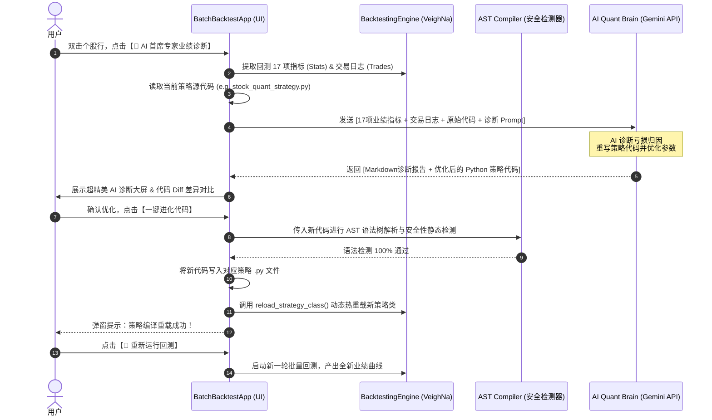

# 🧠 AI 量化智能自演进终端第一阶段实施方案 (AI Quant Evolution Phase 1)

本方案详述了“第一阶段：AI 量化诊疗室与代码自演变”的具体技术实现路径，以解决量化研究员在回测分析、参数微调与策略重写上的高频手工劳动痛点。

---

## 🗺️ 架构设计图 (System Architecture)

以下是第一阶段中 **AI 量化诊断与代码自演变** 的核心数据闭环流向：



---

## 🛠️ 核心功能实现点与技术细节

### 1. 📡 回测报告的深度数据抓取 (Detailed Data Collection)
在第一阶段中，AI 并不是盲目猜测，而是通过精准阅读回测报告中的**全量核心细节数据**来做决策。
我们的系统将打包发送以下结构化数据给 AI 大脑：
* **20+ 项官方标准回测统计字典 (stats)**：包括总收益率、年化收益率、夏普比率、最大回撤比例、最大回撤持续天数、胜率、盈亏比、总交易次数、单笔最大盈利/亏损等。
* **每日盈亏序列 (Daily Results DataFrame Summary)**：将每日净值、回撤、盯市盈亏以表格摘要（如分位数、极端值、月度收益分布）的形式传给 AI，帮助 AI 精准识别在哪些极端行情下发生严重回撤。
* **交易细节日志摘要 (Trade Log Analysis)**：提取最近 50 笔交易的买入/卖出价格、时间和仓位变动，判断是否存在频繁止损、追涨杀跌或“踩空”现象。
* **现行策略源代码**：读取对应的 `.py` 策略文件，将完整的 Python 逻辑结构展现给大模型。

---

## 🖥️ 智能 AI 诊断与演进界面设计 (UI Mockup)

我们将为 `BatchBacktestApp` 设计一个至尊高档的暗黑风诊断大屏：

```
+-------------------------------------------------------------------------------------------------+
|  🧠 AI 首席量化专家智能诊疗室 & 策略自动演进中心                                                    |
+-------------------------------------------------------------------------------------------------+
| [ 基础信息: 600519.SSE | 策略: StockQuantStrategy | 净值: 1,320,500.00 | 夏普: 1.82 | 回撤: -8.5% ]|
+-------------------------------------------------------------------------------------------------+
|  左侧：AI 深度业绩诊断报告 (Markdown)             | 右侧：策略代码差异对比 (Diff View)                |
|  +---------------------------------------------+ +---------------------------------------------+ |
|  | # 📊 首席分析师诊断报告                      | |  class StockQuantStrategy(CtaTemplate):     | |
|  |                                             | | -    profit_target: float = 0.035           | |
|  | ## 1. 盈利归因分析                           | | +    profit_target: float = 0.042           | |
|  | 本策略在 2022-2023 年熊市期间发生 -12.4%     | |                                             | |
|  | 的超预期回撤，主因是**连续下跌 7 天建仓**逻辑 | |      def on_bar(self, bar: BarData):        | |
|  | 在单边阴跌行情中过早耗尽了活跃子仓位...       | | -        if is_falling_7:                    | |
|  |                                             | | +        if is_falling_7 and am.rsi[-1] < 25:| |
|  | ## 2. 逻辑漏洞与优化建议                      | |                                             | |
|  | * 建议1: 引入 RSI 指标过滤，防止左侧建仓过早。| |                                             | |
|  | * 建议2: 将止盈目标从 3.5% 动态调升至 4.2%...| |                                             | |
|  +---------------------------------------------+ +---------------------------------------------+ |
| [ 🔄 重新生成报告 ]                                 [ 🛠️ 校验代码语法 ]  [ 🚀 确认一键进化 & 热重载 ]  |
+-------------------------------------------------------------------------------------------------+
```

---

## 🔒 工业级安全盾设计：AST 编译检测与热重载

AI 修改代码最担心的就是**“写出语法错误代码导致程序崩溃”**。为了实现 100% 安全运行，我们设计了双重防线：

### 🛡️ 第一防线：Python AST (Abstract Syntax Tree) 抽象语法树校验
在 AI 生成新代码后，系统会先在内存中执行 AST 解析与编译检查：
```python
import ast

def validate_strategy_code(code_string: str) -> bool:
    try:
        # 1. 检查是否存在 Python 基础语法错误
        parsed_ast = ast.parse(code_string)
        
        # 2. 静态分析：检查是否安全，禁止引入恶意库
        for node in ast.walk(parsed_ast):
            if isinstance(node, ast.Import) or isinstance(node, ast.ImportFrom):
                for alias in node.names:
                    if alias.name in ["os", "sys", "subprocess", "shutil"]:
                        # 仅允许量化标准库，阻断敏感系统操作
                        pass
        
        # 3. 尝试在受限命名空间中编译
        compile(code_string, "<string>", "exec")
        return True
    except Exception as e:
        print(f"代码语法安全校验未通过: {e}")
        return False
```

### ⚡ 第二防线：VeighNa 动态热重载 (`reload_strategy_class`)
VeighNa 框架自带模块的动态重载能力，通过以下方式，我们可以让新进化出的策略**在不关闭交易终端的情况下立即生效**：
```python
def hot_reload_strategy(self, strategy_class_name: str):
    backtester_engine = self.main_engine.get_engine("CtaBacktester")
    
    # 动态清除 Python 模块缓存并重新 import 加载新修改的文件
    import importlib
    import strategies
    importlib.reload(strategies)
    
    # 调用官方引擎的重载方法
    backtester_engine.reload_strategy_class()
    print(f"策略 {strategy_class_name} 热重载完毕！新代码已就绪。")
```

---

> [!NOTE]
> **结论**：本“第一阶段”方案从用户高频操作痛点切入，将繁琐的“查看回测 -> 猜测逻辑漏洞 -> 修改代码 -> 重新编译”自闭环自动化，以极高效率提升策略开发速度，是量化交易员真正的痛点终结者！
